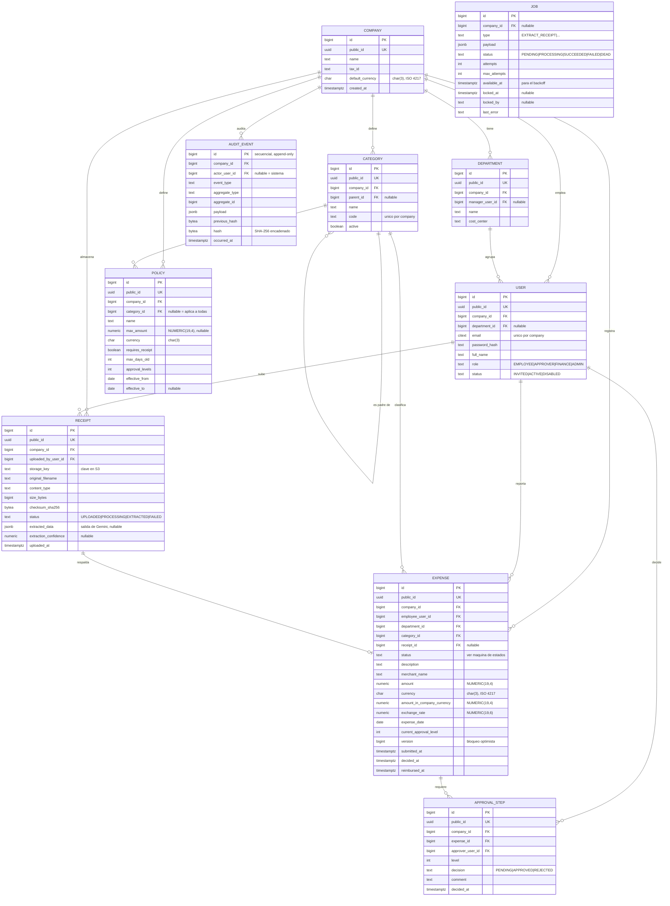

# Diagrama entidad-relación

Modelo de datos de Rindo. El diagrama está escrito en Mermaid para que GitHub lo renderice
directamente y para que los cambios se puedan revisar en un diff, algo imposible con una imagen
binaria.

Los campos y su justificación están en [`docs/modelo-de-dominio.md`](../modelo-de-dominio.md).

## Notas de lectura

- **`company_id` en toda entidad de negocio.** Incluso donde sería deducible por la relación padre
  (`ApprovalStep` podría llegar a `Company` a través de `Expense`). Es redundancia deliberada:
  permite filtrar por tenant con una sola condición y habilita Row Level Security tabla por tabla
  sin joins. Prepara el multi-tenant del ticket #33.
- **Doble identificador.** `id` (`bigint`) es la clave interna y la que usan las claves foráneas: más
  compacta en los índices y secuencial, lo que evita la fragmentación de páginas que provoca un UUID
  aleatorio como clave primaria. `public_id` (`uuid`) es el único que sale en la API y en las URLs,
  de modo que nadie puede enumerar recursos ni deducir cuántos gastos tiene una empresa.
- **`Job` aparece suelto, sin relaciones.** Es deliberado: la cola es genérica y el identificador del
  recibo viaja dentro de `payload` (`jsonb`), no como clave foránea. Así la misma tabla sirve para
  tipos de trabajo futuros sin migrar el esquema.
- **`Receipt` → `Expense` es 1:0..1.** Un recibo puede existir sin gasto (se sube, se extrae y luego
  se descarta) y un gasto puede no tener recibo si la política lo permite
  (`Policy.requires_receipt = false`).
- **`Department.manager_user_id` no se dibuja como relación** para no generar un ciclo visual con
  `DEPARTMENT ||--o{ USER`. Existe como clave foránea nullable hacia `USER`.
