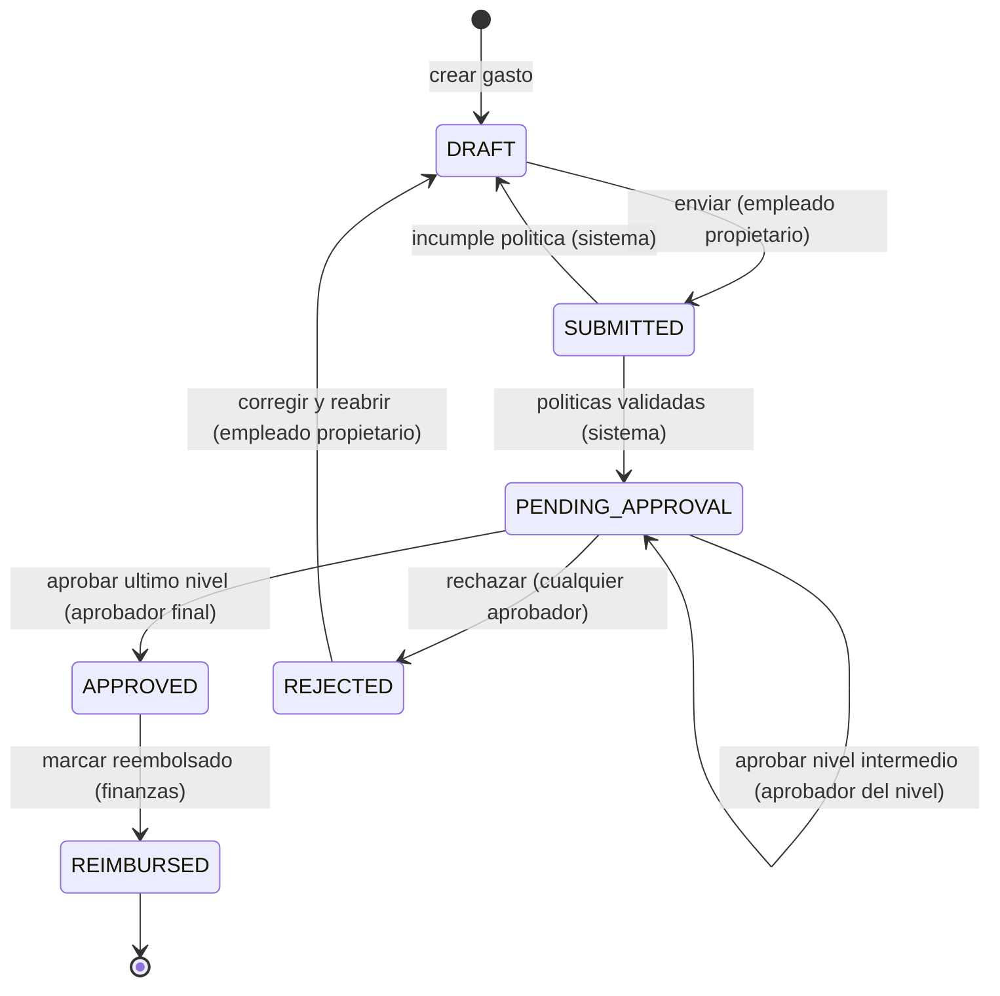

# Máquina de estados del gasto

Ciclo de vida de un `Expense`. Ningún cambio de estado ocurre fuera de estas transiciones: cualquier
otra combinación es un error de dominio y debe rechazarse con `409 Conflict`.

## Quién puede hacer cada transición

| Desde | Hacia | Quién | Condición |
|---|---|---|---|
| `DRAFT` | `SUBMITTED` | Empleado propietario | El gasto tiene importe, categoría y fecha; si la política lo exige, también recibo |
| `SUBMITTED` | `PENDING_APPROVAL` | Sistema | Todas las políticas aplicables pasan. Se generan los `ApprovalStep` de cada nivel |
| `SUBMITTED` | `DRAFT` | Sistema | Alguna política falla. El motivo se devuelve al empleado |
| `PENDING_APPROVAL` | `PENDING_APPROVAL` | Aprobador del nivel actual | Quedan niveles por encima. `current_approval_level` se incrementa |
| `PENDING_APPROVAL` | `APPROVED` | Aprobador del último nivel | Era el nivel final según `Policy.approval_levels` |
| `PENDING_APPROVAL` | `REJECTED` | Aprobador de cualquier nivel pendiente | Requiere comentario obligatorio |
| `REJECTED` | `DRAFT` | Empleado propietario | Reabre para corregir. Los `ApprovalStep` anteriores se conservan como historial |
| `APPROVED` | `REIMBURSED` | Rol `FINANCE` | Terminal |

## Reglas que el diagrama no puede expresar

- **Nadie aprueba su propio gasto.** Si el aprobador asignado coincide con
  `Expense.employee_user_id`, la aprobación escala automáticamente al siguiente nivel. Si no hay
  nivel superior, el gasto pasa al rol `FINANCE`.
- **`REIMBURSED` es terminal.** No hay transición de salida. Un reembolso equivocado se corrige con
  un gasto compensatorio nuevo, nunca revirtiendo el estado: revertirlo rompería la trazabilidad
  contable.
- **Solo el propietario reabre.** Únicamente el propietario mueve el gasto desde `DRAFT` y desde
  `REJECTED`. Un administrador no puede enviar un gasto en nombre de otra persona.
- **Concurrencia.** Dos aprobadores del mismo nivel pueden decidir a la vez. `Expense.version`
  (bloqueo optimista) hace que la segunda escritura falle y se reintente leyendo el estado real, en
  lugar de sobrescribir la primera decisión.
- **Toda transición emite un `AuditEvent`.** Sin excepción, incluidas las que ejecuta el sistema. El
  evento registra estado anterior, estado nuevo, actor y motivo.

## Estados y su significado

| Estado | Significado | ¿Editable? |
|---|---|---|
| `DRAFT` | En elaboración. Solo lo ve su propietario | Sí |
| `SUBMITTED` | Enviado, en validación automática de políticas | No |
| `PENDING_APPROVAL` | Esperando decisión humana en el nivel `current_approval_level` | No |
| `APPROVED` | Aprobado, pendiente de pago | No |
| `REJECTED` | Rechazado con motivo. El empleado puede reabrirlo | No, hasta volver a `DRAFT` |
| `REIMBURSED` | Pagado. Estado terminal | No |
